# Events Package — Code Paths

A TypeScript pub/sub library (`@rhythmiclabs/rhythmic-events`) that layers several abstractions on top of each other: a type-safe event emitter → domain events → a pub/sub bus with pluggable providers and optional persistent caching → higher-level async patterns (suspension, reminders) → a generic in-memory graph store with vector search.

---

## 1. Package Overview & Dependency Map

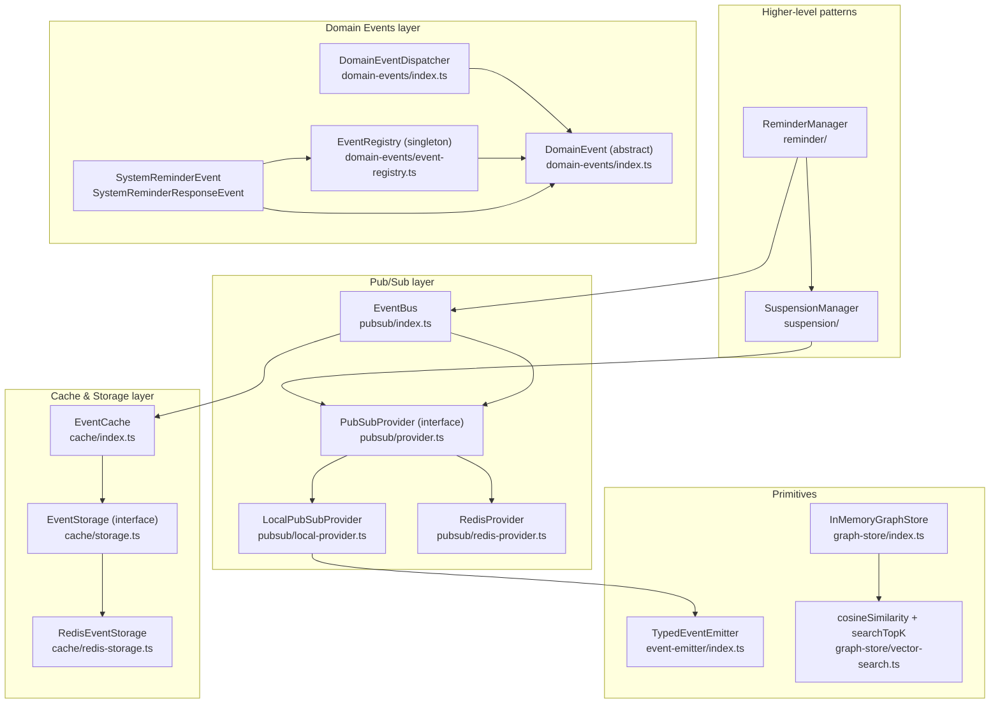

---

## 2. EventBus — Pub/Sub Orchestrator

`EventBus` is the main integration point. It combines a `PubSubProvider` (transport) with an optional `EventCache` (history).

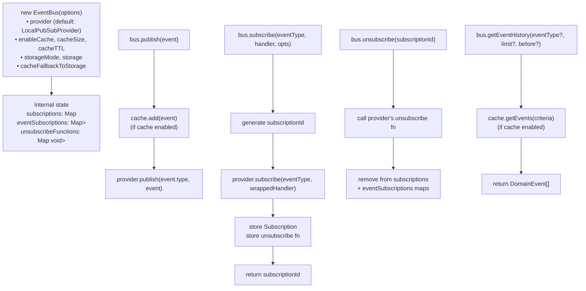

---

## 3. PubSubProvider — Transport Implementations

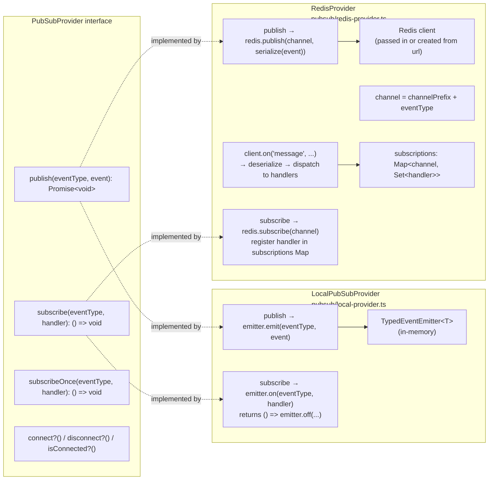

---

## 4. EventCache — Storage Modes & LRU Eviction

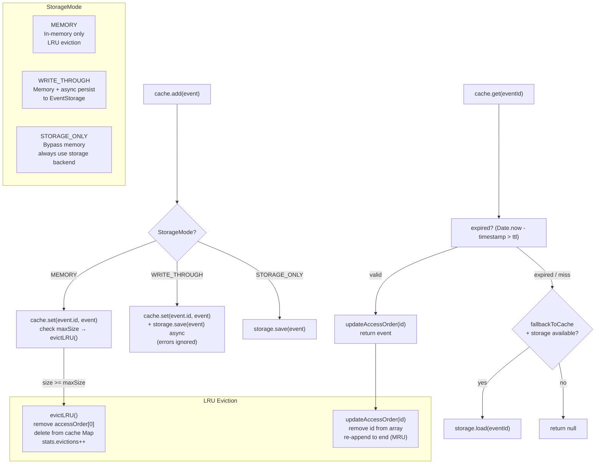

---

## 5. EventStorage — RedisEventStorage Schema

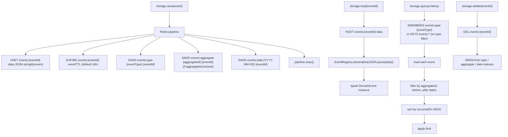

---

## 6. DomainEvent Class Hierarchy & Dispatcher

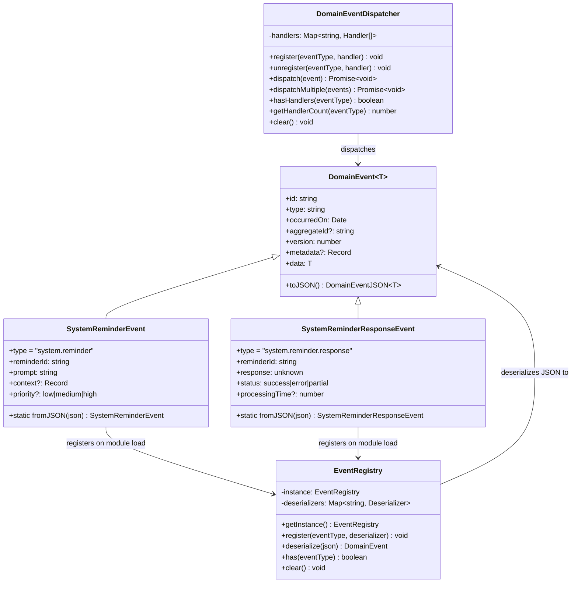

---

## 7. SuspensionManager — Request/Response Over Events

Turns fire-and-forget pub/sub into an async request/response with a configurable timeout.

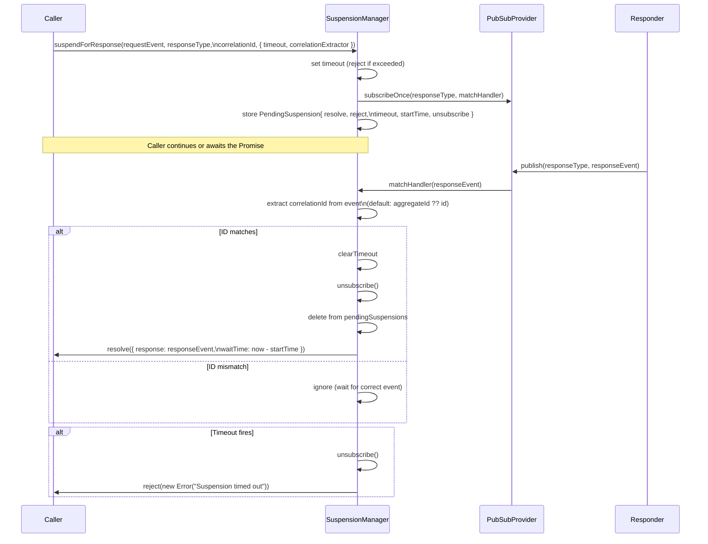

---

## 8. ReminderManager — Automated Workflow Reminders

Composes `EventBus` + `SuspensionManager` to implement a prompt/response pattern for LLM workflows.

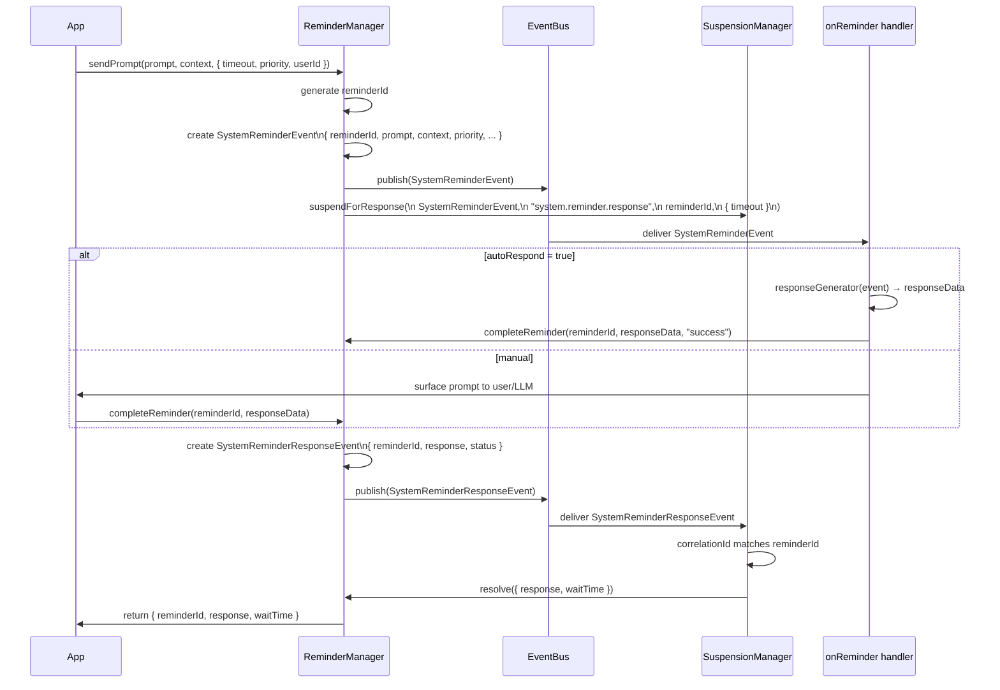

---

## 9. InMemoryGraphStore — LRU + Secondary Indexes + Vector Search

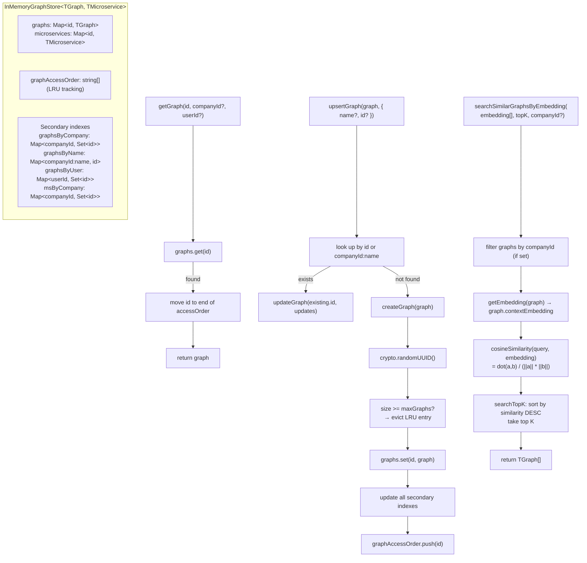

---

## 10. TypedEventEmitter — Type-Safe Async Wrapper

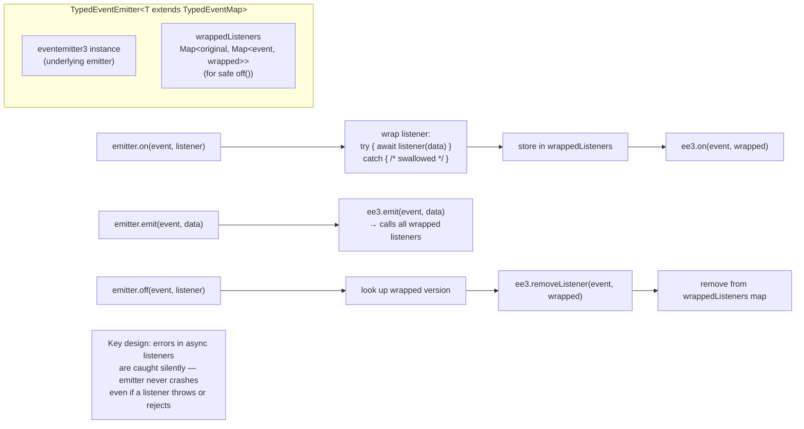

---

## 11. Public API Summary

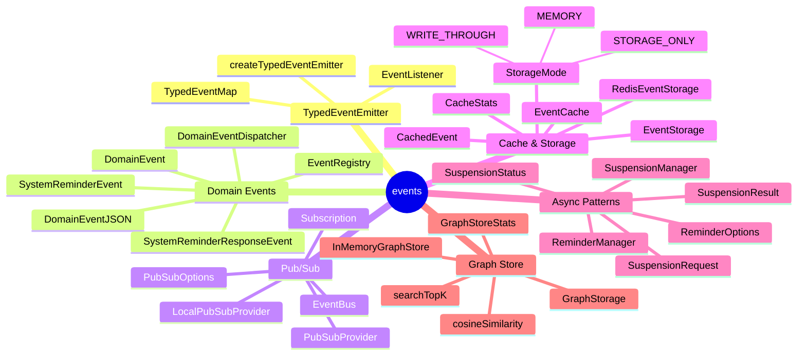

---

## Glossary

| Term | Meaning |
|------|---------|
| **TypedEventMap** | `Record<string, unknown>` — maps event names to payload types for compile-time safety |
| **DomainEvent** | Base class for all events; carries `id`, `type`, `occurredOn`, `aggregateId`, typed `data` |
| **EventRegistry** | Singleton that maps event type strings to deserializer functions; used when loading events from Redis storage |
| **PubSubProvider** | Transport interface — `LocalPubSubProvider` for in-process, `RedisProvider` for distributed |
| **EventCache** | In-memory LRU cache with optional Redis write-through; holds recent `DomainEvent` history |
| **StorageMode** | `MEMORY` (in-process only) / `WRITE_THROUGH` (memory + async persist) / `STORAGE_ONLY` (Redis only) |
| **SuspensionManager** | Converts pub/sub into request/response: publishes a request event and `await`s the matching response |
| **ReminderManager** | Higher-level wrapper; sends `SystemReminderEvent` and uses `SuspensionManager` to await `SystemReminderResponseEvent` |
| **correlationId** | ID threaded through a request/response pair so `SuspensionManager` can match the response to the right awaiter |
| **LRU eviction** | Least-Recently-Used: when the cache/store is full, the entry accessed longest ago is removed first |
| **cosineSimilarity** | `dot(a,b) / (‖a‖·‖b‖)` — measures directional similarity between two embedding vectors; 1 = identical, 0 = orthogonal |
| **searchTopK** | Ranks all items by cosine similarity to a query embedding and returns the K closest |
